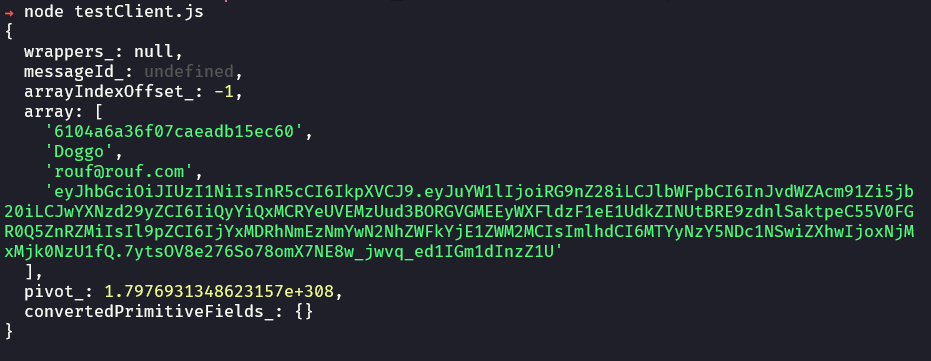
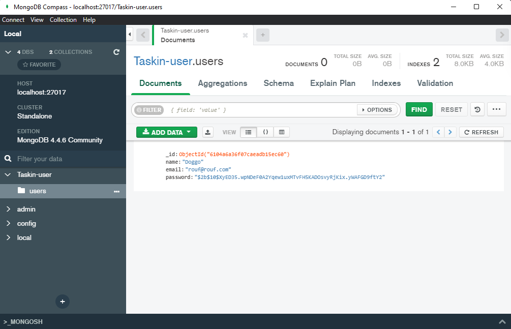

# Taskin-Project

A project to use some stacks and provide a task managment API

## Tech Stack

**Built-in:**

* [NodeJS](https://nodejs.org/)
* [ProtoBuffer](https://developers.google.com/protocol-buffers/)
* [GRPC](https://grpc.io/)
* [Docker](https://www.docker.com/)

## Run Locally

Clone the project

```bash
  git clone https://github.com/leoyassuda/taskin.git
```

Go to the project directory

```bash
  cd taskin
```

Run using docker

```bash
  docker-compose up --build
```

Default port is 8080

To run a local test, execute using node the test client file.

```bash
  node testClient.js
```

Result sample:

* In terminal:
* 
* In mongodb:
* 

## Run Tests

> TODO: Not implemented yet

## API Documentation

> TODO: Not implemented yet

### Authors

* **Leo Yassuda** - *Initial work* - Portfolio [leoyas.com](https://leoyas.com)